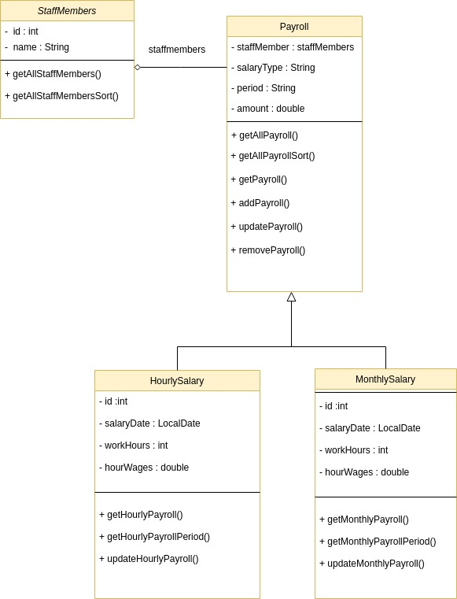

# Webserver - Payroll System
Restfull API  Payroll System for a Employee based on JAX-RS using Eclipse Jersey

Implementation of a webserver which exposes an API to communicate with the payroll system. The implementation is based on Java with Java API for RESTful Web Services (JAX-RS) specification using Eclipse Jersey framework. 

The application is a simple payroll and accounting system accessible via an API. The domain of this system
contains staff members, which have an ID and a name. IDs will increase consecutively. There are be endpoints to add, remove, update and list staff members.

The system should allow getting payrolls for an employee for a certain period. A payroll can be of type fixed salary or hourly salary, which should be stored as attribute of the staff member. For hourly employees there should be an API to add a worklog and to set the hourly wage. For fixed employees it is possible to set the amount for the monthly salary.

Finally one can retrieve a json object with information about the money that should be paid out to an employee in a certain period.

UML Class diagram is added below which provides information about various classes.

StaffMember - will provide list of staff members
Payroll – will provide details about payroll for a staff members
HourlySalary – will provide the hourly payroll for a staff members
MonthlySalary – will provide the monthly payroll for a staff members

StaffMember is associated with payroll class
Payroll class has two types HourlySalary and MonthlySalary
Payroll has salary type which determines hourly or monthly salary.

Requests and Responses for Payroll Server :

Get Request to get all default payroll values :
http://localhost:8080/payroll/webapi/mypayroll

Get request to list all staff members :
http://localhost:8080/payroll/webapi/staffmembers

Get request to sort all staff members:
http://localhost:8080/payroll/webapi/staffmembers/sortstaff

Get Request for retreiving payroll for employee id =1 for date between 2020-02-22 and 2020-02-28
http://localhost:8080/payroll/webapi/mypayroll/1?from=2020-02-22&to=2020-02-28

Get request to sort all payrolls by bubble sort based on employee name :
http://localhost:8080/payroll/webapi/mypayroll/sortpayroll
